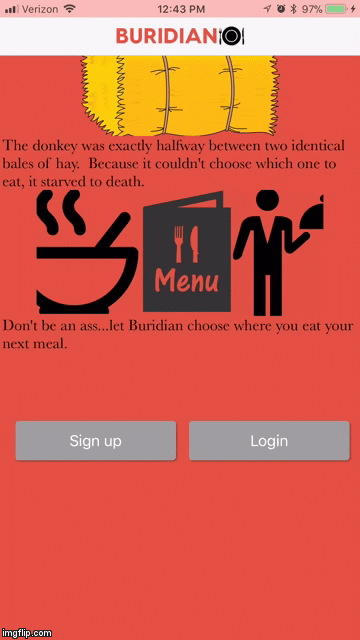
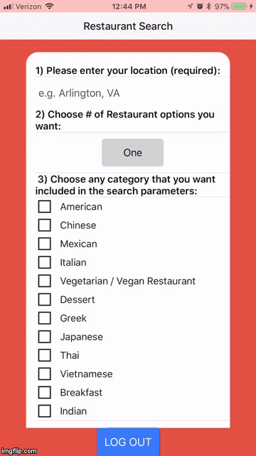
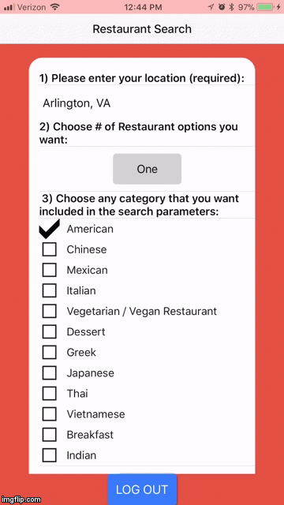
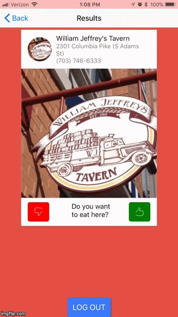

Welcome to Buridian! You may find yourself asking, what on earth is this app called Buridian. Well this app is built and designed to help guide people into making quick and efficient decisions regarding where to eat when they are having difficulty coming to a decision. Whether it be on a date, or group setting, or a solo adventure, Buridian will be sure to send you to the right restaurant! Just follow the quick and easy profile set-up, pick your location, and up to three styles of restaurants! Buridian will take care of the rest, and all you have left to do is swipe away and select a restaurant (be careful though, you’re only allowed one left swipe).

We used a variety of technologies, ranging from, Firebase, foursquare, Axios, Nativebase, Redux, React, React-Native and a whole range of react-native elements (checkout our package.json for the whole list).

This guide was extremely helpful when it came to integrating Firebase into a React-Native based mobile application: https://medium.com/@mosesesan/how-to-build-a-react-native-app-using-firebase-part-1-1210fa206714

Below is a collection of screenshots from our functioning app displaying all facets of the full process:

